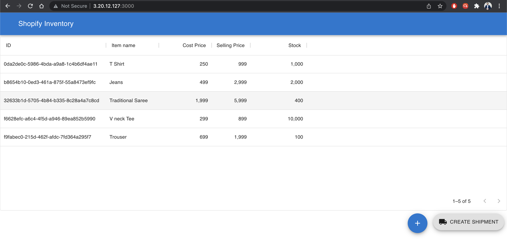

# Shopify Backend Developer Intern Challenge - Summer 2022

### Hosting 
I have hosted the application in AWS, kindly take a look. 

   http://3.20.12.127:3000/

Screenshots:



I have chosen the task to create shipments and assign inventory items. To check the working, click on "Create Shipment" in the floating icon (bottom right corner)

### Usage and setup

Follow the below steps for the setup. 

1. Clone the repo and cd into the main folder, `ShopifyInventory`. 
2. First, download and install postgres locally. Change the application.properties. Input your postgres password. 
3. Since this implementation is based on Java in server, install mvn to start the server. 
4. Client implementation is done in React JS. Install node >= v14.
5. Build the server side Java application using Maven script, mvn is included in the repo. 

   ```mvn package -DskipTests=true```

6. You can start the server using the following command,
    
    ```mvn spring-boot:start -DskipTests=true ```
7. Then, cd into `webapp` folder to install necessary packages and start the client.
    
    ```npm install && npm start```
8. The server will be running in ```http://localhost:8080``` and the client will be running in ```http://localhost:3000```
9. Visit ```http://localhost:3000``` to access the application.  


